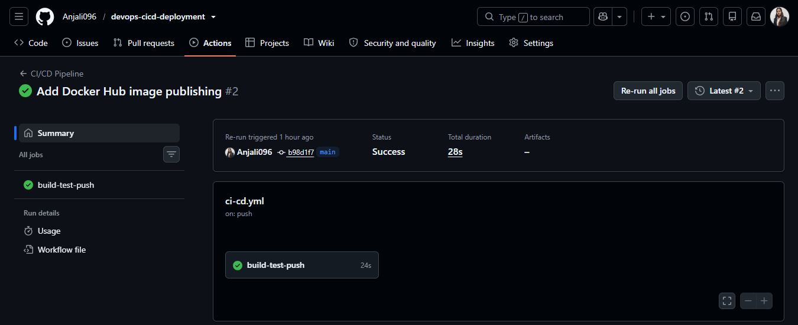

# DevOps CI/CD Pipeline with Docker

A containerized Python Flask application with an automated CI/CD pipeline using GitHub Actions and Docker Hub.

## Overview

This project demonstrates how to automate application testing, Docker image building, and image publishing whenever code is pushed to the `main` branch.

## Architecture

```text
Developer
    |
    v
GitHub Repository
    |
    v
GitHub Actions
    |
    +--> Install Python dependencies
    |
    +--> Run application health check
    |
    +--> Build Docker image
    |
    v
Docker Hub
    |
    v
Pull and run container locally
```

## Tech Stack

- **Language:** Python
- **Web Framework:** Flask
- **Containerization:** Docker
- **CI/CD:** GitHub Actions
- **Container Registry:** Docker Hub
- **Version Control:** Git and GitHub
- **Development Environment:** Ubuntu on WSL

## Features

- Flask web application with a health-check endpoint.
- Dockerized application for consistent execution.
- Automated dependency installation and health-check testing.
- Automated Docker image build on pushes to `main`.
- Automated publishing of the Docker image to Docker Hub.
- Local execution of the published image.

## Application Endpoints

| Endpoint | Description |
|---|---|
| `/` | Application home page |
| `/health` | Returns the application health status |

Expected health-check response:

```json
{
  "status": "healthy"
}
```

## Run the Application with Docker

### 1. Pull the published image

```bash
docker pull anjali098/devops-cicd-app:latest
```

### 2. Run the container

```bash
docker run -d \
  --name devops-app-test \
  -p 5001:5000 \
  anjali098/devops-cicd-app:latest
```

### 3. Test the application

Open these URLs in your browser:

- Home page: http://localhost:5001
- Health check: http://localhost:5001/health

### 4. Manage the container

Check running containers:

```bash
docker ps
```

View application logs:

```bash
docker logs devops-app-test
```

Stop the container:

```bash
docker stop devops-app-test
```

Start it again:

```bash
docker start devops-app-test
```

## CI/CD Workflow

The GitHub Actions workflow runs when code is pushed to the `main` branch.

1. Checks out the repository.
2. Sets up Python 3.12.
3. Installs dependencies.
4. Runs the Flask health-check test.
5. Builds the Docker image.
6. Authenticates to Docker Hub using GitHub repository secrets.
7. Pushes the image with the `latest` tag.

### Required GitHub Secrets

Configure these under **Settings → Secrets and variables → Actions**:

| Secret | Purpose |
|---|---|
| `DOCKERHUB_USERNAME` | Docker Hub username |
| `DOCKERHUB_TOKEN` | Docker Hub access token with appropriate write permission |

Never commit access tokens, passwords, or other credentials to the repository.

## Docker Hub Image

**Image:** [`anjali098/devops-cicd-app`](https://hub.docker.com/r/anjali098/devops-cicd-app)

Pull command:

```bash
docker pull anjali098/devops-cicd-app:latest
```

## What I Learned

- Building and running Docker containers.
- Using Git and GitHub for version control.
- Creating automated workflows with GitHub Actions.
- Testing an application through a health-check endpoint.
- Publishing Docker images to a container registry.
- Managing credentials securely with GitHub repository secrets.
- Troubleshooting Docker daemon and registry permission issues.

## Future Improvements

- Deploy the container to AWS EC2.
- Automate remote deployment through GitHub Actions.
- Add automated unit tests.
- Introduce image versioning and deployment rollback.
- Explore infrastructure as code with Terraform.

---

**Author:** Anjali Kumari

**Repository:** [devops-cicd-deployment](https://github.com/Anjali096/devops-cicd-deployment)

## CI/CD Pipeline — Successful Run

The GitHub Actions workflow successfully tests the application, builds the Docker image, and publishes it to Docker Hub.


